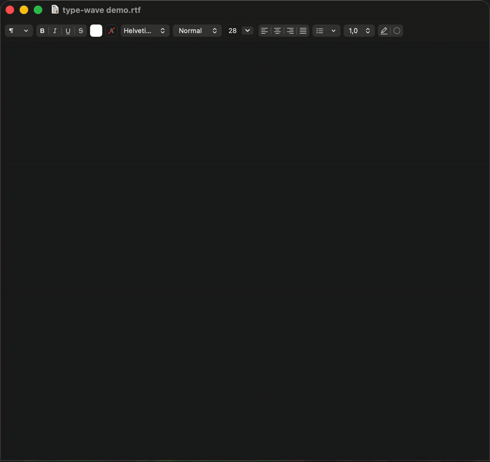
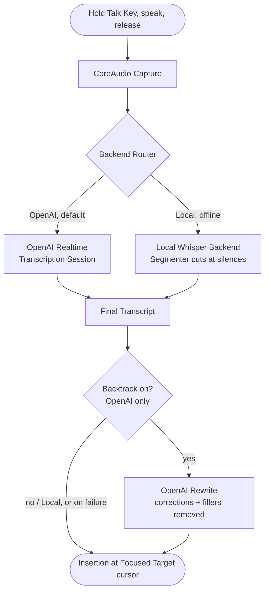

# type-wave

**Hold-to-talk dictation for macOS.** Hold a key, speak, release, and the
transcribed text is inserted at the cursor of the app you are already using.

type-wave is a Zig daemon for Apple Silicon macOS. It captures with CoreAudio and
inserts through macOS event/pasteboard APIs, and transcribes with either of two
backends: **OpenAI's Realtime API** over WebSocket/TLS (streaming, the default), or an
**offline local Whisper** model (audio never leaves your Mac). It can run in the
foreground while developing, or as a signed per-user LaunchAgent for daily use.

<p align="center">
  
</p>

> **Status:** experimental research project, `v0.1.2`, Apple Silicon macOS only.
> Single-maintainer, no support or SLA — small fixes welcome, larger changes worth
> discussing first. The hold-to-talk -> transcribe -> insert pipeline works end-to-end
> on either backend. Distribution hardening (hardened runtime, entitlements,
> notarization) is out of scope for now, so you build from source.

## How It Works



The default **Talk Key** is Right Option. Holding it opens one **Utterance**; while it
is held, type-wave captures mic audio and routes it through the **Backend Router** to
the selected **Transcription Backend**. On release it commits the Utterance and waits
for the **Final Transcript** — the only text ever inserted — then places it at the
**Focused Target** cursor through either a clipboard-swap paste or synthetic keystrokes.

The two backends reach that same Final Transcript by different routes. **OpenAI**
streams: it emits revisable **Partial Transcripts** live, then commits the Final
Transcript on release. **Local Whisper** runs offline: its **Segmenter** cuts a long
Utterance into **Segments** at silences and transcribes them in the background, and the
ordered **Segment Transcripts** concatenate into the Final Transcript. In local mode the
audio never leaves the Mac.

With the opt-in **Backtrack** setting on and OpenAI selected, one more stage sits between
the Final Transcript and Insertion: a single OpenAI **Rewrite** pass applies spoken
self-corrections ("at 20:00 no 18:00" → "at 18:00") and drops fillers ("um", "öh"), so the
inserted text is what you meant to say. Enablement is pinned at Talk Key press, a
mid-Utterance flip cannot half-apply, and any rewrite failure or timeout falls back to
inserting the raw transcript — dictation never breaks. Backtrack sends the transcript
**text** to OpenAI and needs internet; it does not apply on the Local backend, where the
raw transcript inserts unchanged.

Across the whole lifecycle the **Utterance Coordinator** owns the state machine from
Talk Key press to a resolved Insertion. The floating **HUD** is silent visual feedback
only — a red waveform while recording, then green processing dots until the Utterance
resolves; it never shows transcript text. A menu-bar **Status Item** derives readiness
for the selected backend, exposes the OpenAI/local chooser, and keeps full **Model
Installation** management reachable under either selection.

The project vocabulary is kept in [CONTEXT.md](./CONTEXT.md).

## Requirements

Common to both backends:

- Apple Silicon macOS.
- Nix with flakes, or a matching bare Zig nightly. See [docs/toolchain.md](./docs/toolchain.md).
- macOS grants for Input Monitoring, Accessibility, and Microphone.

Then pick a Transcription Backend:

- **OpenAI (default):** an OpenAI API key with access to Realtime transcription. Audio
  streams to OpenAI during dictation.
- **Local Whisper (offline):** no API key and no network at dictation time — only a
  one-time, credential-free download of the pinned model (Whisper Large v3 Turbo). Audio
  stays on your Mac.

## Quick Start

For a foreground development run:

```sh
export OPENAI_API_KEY=sk-...
nix develop --command zig build run
```

On first run, macOS may prompt for:

- **Input Monitoring**: observing the Talk Key.
- **Accessibility**: posting insertion events.
- **Microphone**: capturing audio.

Missing prerequisites do not crash the daemon. It reports what it is waiting for and
self-heals when the key or permission appears.

## Daily Install

Install type-wave as a signed per-user LaunchAgent:

```sh
nix develop --command zig build install-agent
~/.local/bin/type-wave --set-key
```

The install step signs and atomically upgrades the compatible daemon/helper pair through one
shared pair pointer with the local `type-wave dev` identity, exposes them at
`~/.local/bin/type-wave` and `~/.local/libexec/type-wave/type-wave-whisper`, and writes the
LaunchAgent plist. It also installs pinned runtime/model provenance and license material under
`~/.local/share/type-wave/`. Running `--set-key` through the installed signed daemon stores
the OpenAI key in the login keychain so it can be read without prompts across rebuilds.

The one-time signing identity setup, LaunchAgent load/unload commands, and TCC grant
persistence checks are documented in [docs/packaging.md](./docs/packaging.md). Logs go
to `~/Library/Logs/type-wave.log`.

## Configuration

Every field is optional. Copy the annotated example when you want a hand-editable file:

```sh
mkdir -p ~/.config/type-wave
cp packaging/config.example.zon ~/.config/type-wave/config.zon
```

| Field | Default | Notes |
| --- | --- | --- |
| `transcription_backend` | `.openai` | `.openai` or `.local`; selection is a hard audio boundary |
| `talk_key` | `.right_option` | `.right_option`, `.left_option`, or `.globe` |
| `model` | `"gpt-realtime-whisper"` | String, so model experiments do not require a rebuild |
| `language` | `"en"` | `"en"`, `"sv"`, or `""` for auto-detect |
| `delay` | `"low"` | `"minimal"`, `"low"`, `"medium"`, `"high"`; other strings stay hand-editable |
| `noise_reduction` | `.near_field` | `.near_field`, `.far_field`, or `.off` |
| `insertion` | `.paste` | `.paste` or `.keystroke` |
| `pre_paste_ms` | `25` | Pasteboard settle delay before Cmd-V |
| `overlay` | `true` | Show the silent waveform/processing HUD |
| `backtrack` | `false` | Opt-in OpenAI rewrite of spoken self-corrections and fillers; OpenAI backend only, sends transcript text to the cloud |

The menu bar is the live settings writer. It swaps in complete immutable settings
snapshots and patches single fields in `config.zon` while preserving comments. Hand
edits are picked up on restart or the next time the menu opens.

Secrets do not live in `config.zon`. Key precedence is:

1. `OPENAI_API_KEY` from the process environment, for foreground dev runs.
2. The login keychain item created by the menu or `~/.local/bin/type-wave --set-key`.
3. One-time migration from the retired `~/.config/type-wave/env` file, if present.

The pinned local Model Installation (Whisper Large v3 Turbo) downloads credential-free.
Explicitly start the Model Operation:

```sh
~/.local/bin/type-wave --install-model
```

The operation starts only at the exact pinned `huggingface.co` coordinates and
checkpoints only exact validator-matched byte ranges. A cancelled or interrupted operation
never resumes network activity on restart; inspect it with `--model-status`, then explicitly
choose `--resume-model` or `--discard-model`. Download and hashing progress are byte-accurate,
transient retries stop after the displayed budget, and Ctrl-C cooperatively cancels transfer,
hashing, or the helper smoke test. Activation is the only short non-cancellable stage.

`--model-status` derives update availability by comparing the active receipt with the complete
identity embedded in the running type-wave release. An older verified installation remains
ready for offline dictation while `--update-model` stages, verifies, and smoke-tests its
replacement. Activation waits for active local inference to drain, then atomically switches
the receipt; failure or cancellation leaves the working installation selected and usable.

Run `--verify-model` for a full offline integrity check of the active Model Installation.
It hashes every model byte and reports the exact corrupt metadata/artifact class without
reading credentials or using the network. Run `--repair-model` to verify first and preserve
valid local data; metadata-only damage is rebuilt offline, while missing or invalid artifact
data requires typing `yes` before authenticated acquisition begins. A helper load failure
performs this same offline verification before type-wave offers Repair for corruption or
runtime Retry for a verified installation that still cannot load.

After full size/SHA-256 verification and the smoke test, type-wave atomically publishes the
active receipt. Receipts and provenance contain identities and digests, never credentials,
signed URLs, audio, or transcript content.

## Development

```sh
nix develop --command zig build
nix develop --command zig build test
nix develop --command zig build capture-check
```

Useful build modes:

```sh
nix develop --command zig build -Doptimize=Debug
nix develop --command zig build -Doptimize=ReleaseSafe
nix develop --command zig build -Doptimize=ReleaseSmall
```

Plain builds default to `ReleaseFast`, matching the installed daemon, and produce both the
daemon and the private helper from the byte-verified whisper.cpp v1.9.1 source archive. Use
`-Dwhisper-archive=/path/to/whisper.cpp-v1.9.1.tar.gz` for an offline build. `capture-check`
is a live CoreAudio start/stop probe and uses real microphone IO.

## Architecture

The daemon is thin wiring around testable state machines and OS adapters. It transcribes
through either of two backends — OpenAI Realtime (streaming, the default) or offline local
Whisper — selected at runtime behind a Backend Router.

The **Utterance Coordinator** in `src/coordinator.zig` owns the utterance lifecycle:
`idle -> capturing -> awaiting_final -> rewriting -> inserting -> idle`. The optional
`rewriting` phase runs the Backtrack pass (OpenAI only) when it applies and is otherwise a
pass-through. It handles the overlap guard, release-anchored deadline, empty or failed
transcripts, dropped sessions, and failed insertions. Hardware and OS effects reach it
through seams.

`src/daemon.zig` builds the real adapters, starts the threads, runs the menu/HUD/tap main
loop, and drives readiness through a pure per-tick self-heal decider (`src/supervisor.zig`).
Several state machines run outside the Coordinator: configuration readiness
(`src/configuration_phase.zig`), OpenAI link state (`src/session.zig`), backend selection
(`src/backend_router.zig`), local load-failure classification
(`src/local_model_recovery.zig`), the local Whisper helper lifecycle
(`src/whisper_supervisor.zig`), and the cold-start permission-grant sequence
(`src/grant_sequence.zig`).

**Core pipeline**

| Module | Role |
| --- | --- |
| `src/main.zig` | CLI entry point and `--set-key` subcommand |
| `src/daemon.zig` | Long-running daemon wiring, threads, supervisor, menu seams |
| `src/coordinator.zig` | Utterance lifecycle state machine |
| `src/supervisor.zig` | Pure per-tick self-heal decider and capture-enable gate |
| `src/appkit.zig` | NSApplication bring-up and main run loop |

**Transcription backends**

| Module | Role |
| --- | --- |
| `src/backend_router.zig` | Utterance-to-backend routing with the drain-then-switch selection FSM |
| `src/transcription_backend.zig` | Backend-neutral transcription contract and deadline types |
| `src/session.zig` | Warm OpenAI Realtime transcription session and reconnect logic |
| `src/local_backend.zig` | Segmenting local Whisper transcription backend adapter |
| `src/segmenter.zig` | Pure silence-cut segment policy |

**Local Whisper runtime**

| Module | Role |
| --- | --- |
| `src/whisper_runtime.zig` | whisper.cpp Metal runtime FFI wrapper |
| `src/whisper_helper.zig` | Whisper Helper subprocess server (runtime plus IPC loop) |
| `src/whisper_helper_core.zig` | Pinned model identity and inference preparation/gate core |
| `src/whisper_ipc.zig` | Whisper Helper IPC frame protocol |
| `src/whisper_process_helper.zig` | Parent-side warm helper process owner and relaunch ladder |
| `src/whisper_supervisor.zig` | Whisper Helper event/state machine and recovery budget |

**Local model provisioning & storage**

| Module | Role |
| --- | --- |
| `src/model_store.zig` | Explicit credential-free Model Operations and atomic Model Installation activation |
| `src/model_operation.zig` | Model Operation child-process runner and its observation |
| `src/operation_channel.zig` | Typed Model Operation observation wire (child stdout) |
| `src/local_provisioner.zig` | Warms the local backend with corruption-vs-runtime recovery latch |
| `src/local_model_recovery.zig` | Local integrity verification versus runtime-load recovery policy |
| `src/layout.zig` | Single owner of the on-disk models-root path grammar |
| `src/artifact_identity.zig` | Pure size/sha256 model-artifact identity codec |
| `src/installation_identity.zig` | Owned Model Installation receipt identity for cross-thread presentation |
| `src/receipt.zig` | Installation Receipt codec (schemas plus PROVENANCE/partial.meta) |

**Configuration & readiness**

| Module | Role |
| --- | --- |
| `src/config.zig` | ZON settings, key loading, immutable settings snapshots, config writes |
| `src/configuration_phase.zig` | Setup readiness transitions and reporting |
| `src/readiness.zig` | Pure readiness/status policy |
| `src/grant_sequence.zig` | Serialized cold-start TCC grant request sequence |
| `src/failure_observation.zig` | Cross-thread failure snapshot the status item reads |

**Audio, insertion & input**

| Module | Role |
| --- | --- |
| `src/capture.zig` | CoreAudio capture |
| `src/tap.zig` | Global Talk Key observation |
| `src/insert.zig` | Clipboard paste and synthetic keystroke insertion |
| `src/insertion_adapter.zig` | Async insertion worker around the Coordinator |

**Backtrack rewrite**

| Module | Role |
| --- | --- |
| `src/rewrite_adapter.zig` | Async Backtrack rewrite worker; falls back to the raw transcript on failure |
| `src/openai_rewrite.zig` | OpenAI Responses API rewrite mechanism over a warm HTTPS client |

**UI, feedback & platform**

| Module | Role |
| --- | --- |
| `src/menu.zig` | Menu-bar AppKit item and live settings UI |
| `src/status_item.zig` | Pure status-item presentation policy |
| `src/hud.zig` | Silent waveform/processing overlay |
| `src/surface.zig` | HUD-vs-sound feedback arbitration |
| `src/feedback.zig` | Sound cues and timestamped logging |
| `src/keychain.zig` | OpenAI login-Keychain item |
| `src/info_plist.zig` | Embedded `Info.plist` Mach-O section |

## Repository Layout

```text
src/                 daemon source
docs/                toolchain, packaging, ADRs, research notes, agent docs
packaging/           Info.plist, LaunchAgent plist, install script, config example
prototypes/          spikes that proved capture, insertion, menu, and HUD behavior
vendor/              vendored karlseguin/websocket.zig
flake.nix            development shell pinning the Zig nightly
```

## Notes

- The Zig nightly and vendored `websocket.zig` commit move together. Read
  [docs/toolchain.md](./docs/toolchain.md) before bumping either.
- Architecture decisions live in [docs/adr](./docs/adr).
- Research crib sheets live in [docs/research](./docs/research).
- Work tracking conventions are in [docs/agents/issue-tracker.md](./docs/agents/issue-tracker.md).

## License

type-wave is released under the [MIT License](./LICENSE), Copyright (c) 2026
Björn Ahl.

It builds on MIT-licensed third-party components (vendored `websocket.zig`,
whisper.cpp, and the Whisper large-v3-turbo model). Their attributions and
license-text locations are listed in
[THIRD-PARTY-NOTICES.md](./THIRD-PARTY-NOTICES.md); pinned revisions and hashes
are in [packaging/share/type-wave/PROVENANCE](./packaging/share/type-wave/PROVENANCE).
